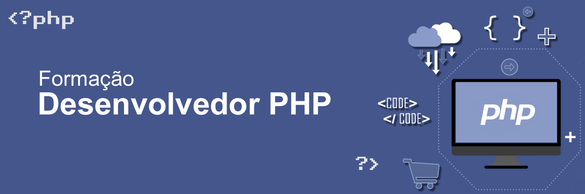
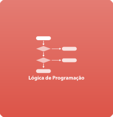

<h1 align="center"></h1>

<h1 align="center">
    
    <br/>
    <br/>
    🎓🐘 Formação PHP - TreinaWEB 🐘🎓
</h1>

## 🧑‍💻Desenvolvedor PHP
<p>Nesta formação aprendemos todos os conceitos da linguagem PHP, uma das mais utilizadas no mercado. Desde conceitos de base, até caracteristicas mais avançadas, como orientação a objetos, boas práticas de mercado, integração com banco de dados.</p>

### 🐘 PHP, A linguagem
<P>O PHP é uma linguagem de script open source de uso geral, muito utilizada, e especialmente adequada para o desenvolvimento web e que pode ser embutida dentro do HTML.</p>

```php
<!DOCTYPE HTML>
<html>
    <head>
        <title>Exemplo</title>
    </head>
    <body>

        <?php
            echo "Olá, eu sou um script PHP!";
        ?>

    </body>
</html>
```
### Linguagens de Scripts

PHP é um acrônimo recursivo para PHP: Hypertext Preprocessor (Pré-Processador de Hipertexto), que originalmente se chamava Personal Home Page (Página Inicial Pessoal).

Ele também é um subconjunto de linguagens de scripts como JavaScript e Python. A diferença é que PHP costuma ser mais usado para comunicação do lado do servidor (back-end). 

Enquanto isso, JavaScript pode ser usado tanto para o front-end quanto para o back-end – e Python é apenas para o lado do servidor (back-end).

## 🎓 Sobre a formação

A formação **Desenvolvedor PHP** da [TreinaWEB](https://www.treinaweb.com.br/formacao/desenvolvedor-php) é constituida por 20 cursos que totalizam mais de 102 horas de aula e 647 exercícios.

### O que será visto?

#### 01 - Lógica de Programação


<style type="text/css">
.tg  {border-collapse:collapse;border-spacing:0;}
.tg td{border-color:black;border-style:solid;border-width:1px;font-family:Arial, sans-serif;font-size:14px;
  overflow:hidden;padding:10px 5px;word-break:normal;}
.tg th{border-color:black;border-style:solid;border-width:1px;font-family:Arial, sans-serif;font-size:14px;
  font-weight:normal;overflow:hidden;padding:10px 5px;word-break:normal;}
.tg .tg-73oq{border-color:#000000;text-align:left;vertical-align:top}
</style>
<table class="tg">
<thead>
  <tr>
    <th class="tg-73oq" rowspan="4"></th>
    <th class="tg-73oq">01 - Lógica de Programação</th>
  </tr>
  <tr>
    <td class="tg-73oq">36 Horas<br>62 Exercícios<br>15 Desafios de Código<br></td>
  </tr>
  <tr>
    <td class="tg-73oq">Repositório: </td>
  </tr>
  <tr>
    <td class="tg-73oq">Certificado: </td>
  </tr>
</thead>
</table>


https://www.treinaweb.com.br/curso/logica-de-programacao
